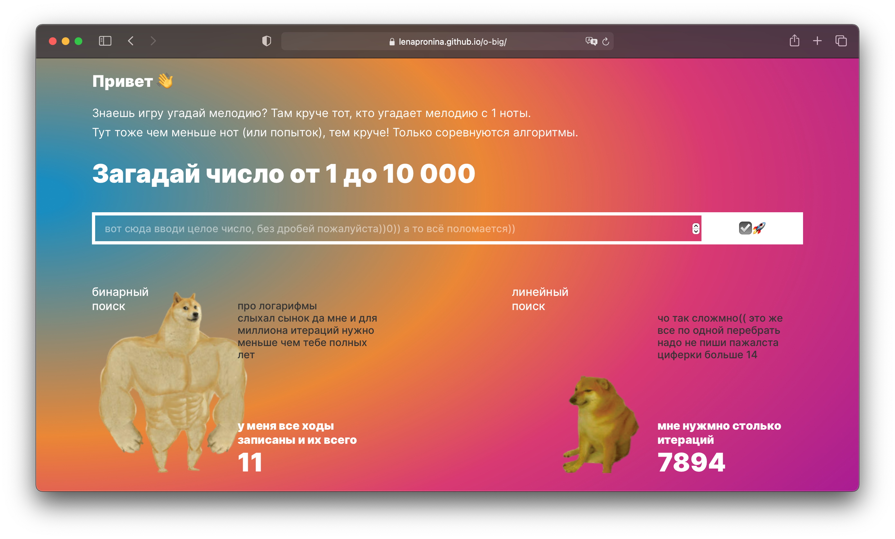

# O-BIG
[Ссылка на GitHubPages](https://lenapronina.github.io/o-big)


## О проекте
O-BIG – небольшой интерфейс посвященный сравнению работы линейного и бинарного поиска. 
По мотивам первой главы книги [Грокаем алгоритмы](https://github.com/KiraJS/grokking-algorithms).

### Функциональность
Приложение написано на JS с использованием классов. Верстка реализована по принципу mobile first. Информация о жалобах хранится в базе данных Mongo, бэкенд развернут при помощи сервсиов Strapi и Heroku.

### Запуск проекта

Перед стартом убедитесь, что у вас установлен node.

1. Склонировать репозиторий
  ```
  git clone https://github.com/lenapronina/o-big.git
  ```
2. Перейти в директорию с проектом
  ```
  cd o-big
  ```
3. Установить зависимости
  ```
  npm install
  ```
4. Запустить приложение  
  ```
  npm run dev
  ```
5. Собрать оптимизированный build
  ```
  npm run build
  ```
6. Публикация на gh-pages с ссылкой на homepage
  ```
  npm run deploy
  ```

### Используемые технологии
HTML · CSS · BEM · JS · git · githubPages · webpack · npm